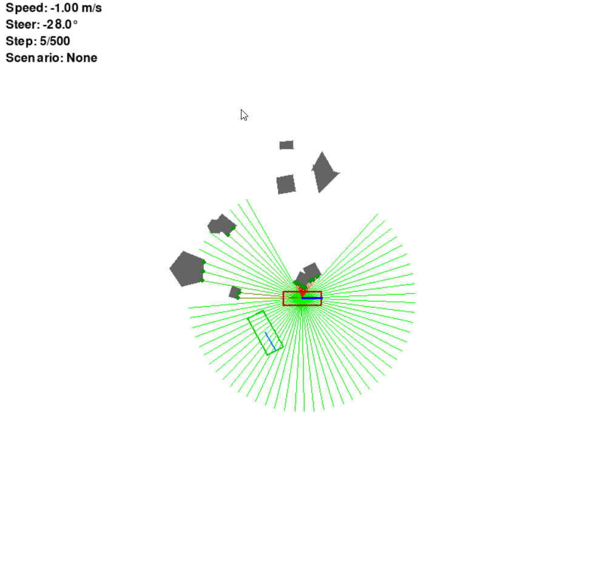

# ParkingEnv
A simple environment for Parking

```
ParkingEnv/
│
├── custom_policy_model.py    # 自定义网络结构
├── lidar.py                  # 高效二维雷达
├── manual_arc_env.py         # 手动测试泊车环境
├── manual_*.py               # 手动测试泊车环境（不同车辆类型）
├── Test.py                   # 测试泊车模型
├── Train.py                  # 训练泊车模型
├── vehicle/
│   ├── vehicle_arc.py        # 离散轨迹车辆模型（主要本动作设计上训练）
│   ├── vehicle_base.py       # 车辆模型基类
│   └── vehicle_*.py          # 其他车辆模型
└── parking_env_pkg/
    ├── parking_core.py       # ParkingEnv 主循环需要的：奖励、终止等gym接口
    ├── render.py             # 使用 pygame 对场景（自车、车位和障碍）进行绘制 
    ├── scenario_manager.py   # 加载 / 随机生成场景 --- 后续需要课程学习在此处进行修改！
    └── utils.py              # 角度归一化、车与车位角顶点计算
```

需要的包请自行安装，应该只有pytorch、stable-baselines3、numba等

训练只需要执行：
```
python Train.py
```

测试只需要指定模型（或直接在Test.py中修改模型路径）执行：
```
python Test.py --model="./runs/ppo_arc/checkpoints/your_checkpoint.zip" --play
```

也可以手动测试泊车环境，使用键盘控制车辆：
```
python manual_arc_env.py
```


